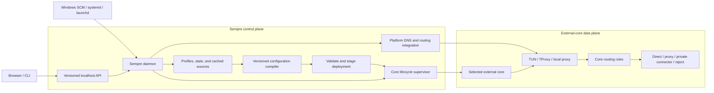
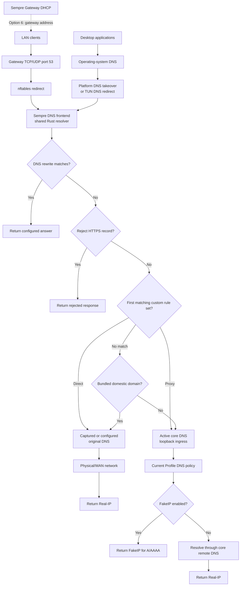
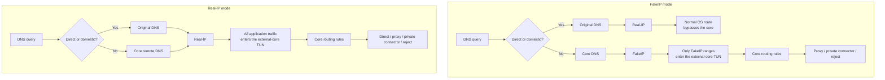
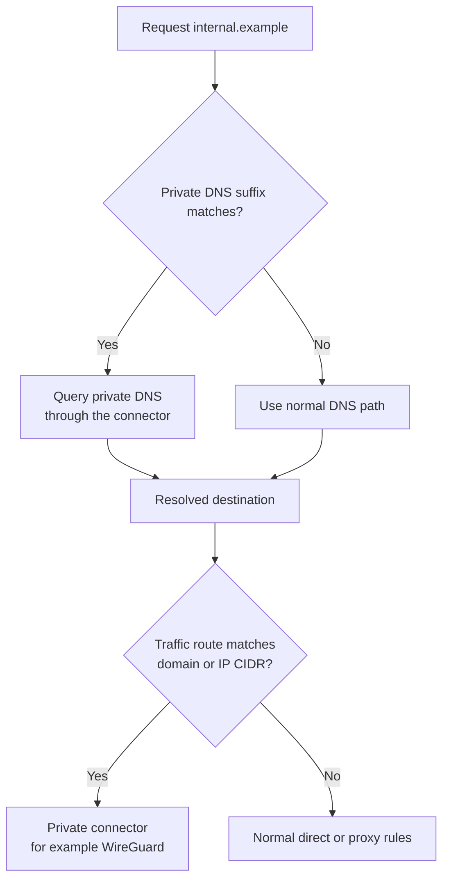

# Sempre

[English](README.md) | [简体中文](README.zh-CN.md)

Sempre is a cross-platform lifecycle manager for proxy cores.

It installs and switches core versions, validates and updates configuration, registers a native system service, and keeps the selected core running. Supported cores currently include [sing-box](https://github.com/SagerNet/sing-box) and [Mihomo](https://github.com/MetaCubeX/mihomo).

> Any core. Always current. Always running.

Project homepage: [sempre.run](https://sempre.run)

Sempre is an independent community project. It is not affiliated with SagerNet, Project X, MetaCubeX, or their respective projects.

> [!WARNING]
> Sempre is pre-1.0 software that installs a privileged system service and manages network proxy processes. Review release notes, keep a working recovery path, and test upgrades on a non-critical machine first. Initial v0.1 binaries are not code-signed; verify checksums and GitHub attestations before running them.

## Why

Sempre replaces platform-specific wrapper scripts and third-party service hosts with one Rust binary and a separately replaceable Web UI:



Sempre is the management and control plane. The selected external core owns the TUN, proxy protocols, packet processing, and traffic-routing data plane.

Windows service support is implemented directly with the Windows SCM API. Sempre does not download, bundle, or invoke NSSM or PowerShell.

## Quick Start

Linux and macOS:

```sh
curl -fsSL https://sempre.run/install | sh
```

Windows PowerShell:

```powershell
irm https://sempre.run/install.ps1 | iex
```

The command generator at [sempre.run](https://sempre.run) can include a core, subscription URL, and Web UI source in the same verified installation. For example:

```sh
curl -fsSL https://sempre.run/install | sh -s -- --core='sing-box:tinymins/sing-box@13.11.2' --subscription='https://domain.com/some-subscription/xxx1safsadf'
```

```powershell
& ([scriptblock]::Create((irm https://sempre.run/install.ps1))) -Core 'sing-box:tinymins/sing-box@13.11.2' -Subscription 'https://domain.com/some-subscription/xxx1safsadf'
```

Core references use `<adapter>[:<github-owner>/<repository>][@<stable-or-version>]`. On a fresh installation, omitting `--core`/`-Core` selects `sing-box@stable`; an existing selection is preserved. A subscription URL is added to the unnamed default subscription set, duplicate URLs are removed, the set is activated and refreshed, and the resulting deployment must reach the running state or the installer fails. The URL is passed from the online script to Sempre through a private temporary file instead of a child-process argument. Because it is still present in the command itself, treat shell history and shared terminals as sensitive.

The UI option accepts `official`, an HTTPS ZIP, or a GitHub release reference such as `tinymins/sempre-ui@stable`. HTTPS ZIPs can include `--ui-sha256='<digest>'` or `-UISha256 '<digest>'`. GitHub UI releases must contain `sempre-ui.zip` and provide its SHA-256 through release asset metadata or `SHA256SUMS`. When the UI option is omitted, a custom installed UI is kept; a fresh installation uses the official UI.

The installer detects the operating system and architecture, resolves one concrete GitHub Release tag, and verifies the matching bundle against that release's `SHA256SUMS` before running it. The scripts are available for review at [sempre.run/install](https://sempre.run/install) and [sempre.run/install.ps1](https://sempre.run/install.ps1).

The verified bundle then runs:

```text
sempre install
```

`install` can be run repeatedly to install, repair, or upgrade Sempre from the current bundle. It copies the binary and bundled UI to protected system storage, registers the native service, starts the Web control plane, and opens it in the default browser. Existing subscriptions, tunnels, gateway settings, Web settings, and custom UI are preserved unless an explicit install option asks to replace them. Without a subscription or existing configuration, the service reports `idle` until one is configured. Open a new terminal after installation; `sempre status`, `sempre doctor`, and the rest of the CLI are available globally.

On Linux, sing-box and Mihomo profiles can run as a TUN router or as a fully managed TProxy gateway. Debian, Ubuntu, and Proxmox VE setup, routing ownership, MetaCubeX access, and recovery procedures are documented in [Linux Transparent Gateway](docs/linux-transparent-gateway.md). The stable, planned, experimental, and protocol-only compatibility boundaries are recorded in the [Core Capability Model](docs/core-capability-matrix.md).

For an offline or fully manual installation, download and extract a bundle from the [Downloads](#downloads) section and run `sempre install` yourself.

Running the binary without arguments, including by double-clicking it, shows only the current version/status and up to four actions:

| Action | Result |
| --- | --- |
| Open Web UI | Opens the discovered local control-plane address |
| Install, Repair, or Upgrade | The launcher chooses one label from the service state and installed version, then runs the idempotent system installation from the current bundle |
| Uninstall | Keeps configuration by default, with an explicit purge choice |
| Run Portable | Runs the Web control plane and selected core beside the binary; shown only while the system service is inactive |

The launcher contains no settings. Configure everything through the Web UI or the equivalent CLI commands. A complete CLI setup remains available:

```text
sempre core install sing-box@stable
sempre core use sing-box@stable
sempre subscription set https://example.com/subscription
sempre open
```

To keep both the binary and its data in one movable directory:

```text
sempre --portable portable run
```

`sempre portable enable` creates a persistent `.sempre-portable` marker beside the executable. `--portable` and `--system` select a mode for one invocation.

## Downloads

Canonical releases are published at [github.com/tinymins/sempre/releases](https://github.com/tinymins/sempre/releases). Bundles are recommended because they include the verified official UI and preinstalled stable sing-box, Mihomo, Xray, and V2Ray cores:

| Platform | amd64 | arm64 |
| --- | --- | --- |
| Windows | [Bundle](https://github.com/tinymins/sempre/releases/latest/download/sempre-bundle-windows-amd64.zip) | [Bundle](https://github.com/tinymins/sempre/releases/latest/download/sempre-bundle-windows-arm64.zip) |
| Linux | [Bundle](https://github.com/tinymins/sempre/releases/latest/download/sempre-bundle-linux-amd64.zip) | [Bundle](https://github.com/tinymins/sempre/releases/latest/download/sempre-bundle-linux-arm64.zip) |
| macOS | [Bundle](https://github.com/tinymins/sempre/releases/latest/download/sempre-bundle-darwin-amd64.zip) | [Bundle](https://github.com/tinymins/sempre/releases/latest/download/sempre-bundle-darwin-arm64.zip) |

Standalone binaries remain available and install the service without bundled UI or cores. Place the canonical `resources/` directory beside a standalone binary for an offline UI install, or add the UI later with `sempre ui install official`:

| Platform | amd64 | arm64 |
| --- | --- | --- |
| Windows | [Download](https://github.com/tinymins/sempre/releases/latest/download/sempre-windows-amd64.exe) | [Download](https://github.com/tinymins/sempre/releases/latest/download/sempre-windows-arm64.exe) |
| Linux | [Download](https://github.com/tinymins/sempre/releases/latest/download/sempre-linux-amd64) | [Download](https://github.com/tinymins/sempre/releases/latest/download/sempre-linux-arm64) |
| macOS | [Download](https://github.com/tinymins/sempre/releases/latest/download/sempre-darwin-amd64) | [Download](https://github.com/tinymins/sempre/releases/latest/download/sempre-darwin-arm64) |

Release checksums are available from [`SHA256SUMS`](https://github.com/tinymins/sempre/releases/latest/download/SHA256SUMS). Each target also includes a CycloneDX JSON SBOM. Verify build provenance with:

```text
gh attestation verify <downloaded-binary> --repo tinymins/sempre
```

## Core Versions

Sempre treats mutable channels and exact versions differently:

```text
sempre core install sing-box@stable
sempre core install sing-box@1.13.15
sempre core install sing-box:tinymins/sing-box@stable
sempre core install sing-box:tinymins/sing-box@1.13.15-ddns.1
sempre core install mihomo@stable
sempre core install mihomo@1.19.29
sempre core list
sempre core use sing-box@stable
sempre core use mihomo@stable
sempre core use sing-box@1.13.15
sempre run --core sing-box@1.13.15
sempre core update sing-box@stable
sempre core remove sing-box@1.13.15
```

Core references use `<adapter>[:<github-owner>/<repository>][@<stable-or-version>]`. Each adapter has an official default repository:

| Adapter | Default repository | Compiled configuration | Release package |
| --- | --- | --- | --- |
| `sing-box` | `SagerNet/sing-box` | Version/platform-specific sing-box JSON | ZIP on Windows, tar.gz elsewhere |
| `mihomo` | `MetaCubeX/mihomo` | Clash Meta YAML | ZIP on Windows, single-file gzip elsewhere |

Repository and version are separate identity dimensions: an official `1.13.15` and a fork's `1.13.15` can be installed and selected independently without changing the version reported by either binary. A custom source must remain explicit in later commands, for example `sempre core use sing-box:tinymins/sing-box@1.13.15-ddns.1`.

On amd64, the Mihomo adapter detects the host's x86-64 microarchitecture level. Level 3 hosts try `v3`, then `v2`, then `compatible`; level 2 hosts try `v2`, then `compatible`; all other or unknown hosts use `compatible`. Sempre never selects a binary above the detected CPU level and does not use the unqualified amd64 asset. arm64 uses the official OS/arm64 asset directly. Custom Mihomo repositories must follow the same asset naming and SHA-256 metadata contract.

`stable` keeps its existing meaning for every repository: the latest non-draft, non-prerelease GitHub Release. Install a prerelease fork build by its exact version. Sempre does not provide an implicit prerelease channel.

An exact install is retained until explicitly removed. A channel is a weak reference to a concrete version. When `stable` advances, its previous version is removed only when no exact install, active deployment, rollback deployment, or other channel still references it.

Installing a version never changes the selected core. Run `core use` after the first install; this is allowed before a configuration exists. The next profile save, `subscription set`, or `config import` converts the subscription for that selection, validates it with the installed core, and stages it. A channel update is validated against the current configuration before the channel advances.

`core remove` removes the concrete version directory and every channel alias
that points to it. Removal fails while the version is selected, active, or
retained as the one automatic rollback deployment.

`sempre run --core` temporarily runs an installed version without changing the
service selection.

## Configuration

```text
sempre subscription list
sempre subscription create <name>
sempre subscription show [profile-id]
sempre subscription save <profile-id> <profile.json>
sempre subscription use <profile-id>
sempre subscription update [profile-id]
sempre subscription render <profile-id> [format]
sempre subscription source add-url <http-or-https-url>
sempre subscription source add-raw <file>
sempre subscription set <http-or-https-url>
sempre subscription schedule 24h
sempre subscription schedule off
sempre subscription auto-restart <true|false>
sempre subscription status
sempre subscription clear
sempre subscription set ""
sempre custom-node <list|add|update|remove>
sempre config import <file>
sempre update
```

Sempre stores multiple subscription profiles and keeps exactly one active. A
profile can combine HTTP/HTTPS sources, raw subscription text, and reusable
custom nodes. `config import` adds its file as a raw source; it no longer
bypasses conversion by installing a complete core configuration. Both clear
forms remove the active profile's sources and check history while retaining
the active configuration.

The active profile is shared by every core. Sempre stores a separate compiled
configuration for each adapter and records the profile revision and compiler
target that produced it. Switching cores reuses a configuration only when that
metadata is current; otherwise Sempre recompiles from cached subscription
snapshots, validates with the selected binary, and stages the new deployment
without fetching remote sources. Explicit and scheduled subscription refreshes
update remote snapshots and make the other cores' compiled configurations
stale until they are selected again.

The shared Rust conversion pipeline accepts Clash YAML/JSON proxy lists and lenient
Base64 URI subscriptions. It parses VLESS, VMess, Shadowsocks, Trojan,
Hysteria, Hysteria 2, TUIC, and AnyTLS nodes, then produces Clash, Clash Meta,
clash-rs, sing-box v1.11-v1.14, Xray, V2Ray, or dae configurations. Linux gateway profiles default
to TUN router mode. The selected core version and host platform choose the
format used for an active profile. Rule-provider YAML is fetched
and embedded for sing-box, so generated configurations do not depend on a
public Sempre conversion endpoint.

The top-level `update` command updates only the subscription. Core channels
are updated explicitly with `core update`.

Each subscription response is limited to 32 MiB and may be downloaded through
HTTP or HTTPS. Redirects remain restricted to those schemes. Fetches retry up
to three times and use a persistent last-known-good cache keyed by URL,
User-Agent, and fetch mode. Raw responses and generated configurations are
stored by content hash. Profile edits are persisted locally without fetching,
compiling, or validating a core; explicit refresh or runtime startup performs
that work. Failed downloads, conversion, validation, resolve, or startup retain
the previous deployment. Subscription data uses restricted permissions and URLs
are omitted from normal status output and logs.

Automatic checks for enabled URL sources in the active profile run every 24
hours by default. The global interval has a five-minute minimum. A changed
scheduled configuration is staged and, by default, restarts the managed core;
`subscription auto-restart false` leaves it pending. Interactive profile
changes never restart the core automatically. Restart it explicitly after
reviewing the preview, or leave the staged configuration for the next start.
An empty profile remains valid and retains the last active configuration.

## DNS and Traffic Routing

DNS resolution and application traffic are separate paths. Sempre keeps them consistent without turning its DNS frontend into a proxy core or a TUN data plane.

### DNS Frontend and Gateway DNS

Desktop system DNS and Linux gateway DNS enter the same managed Rust resolver. Gateway DHCP advertises the gateway address through DHCP option 6; nftables redirects LAN TCP/UDP port 53 to the managed frontend. Gateway mode changes how queries reach the frontend, not who owns DNS policy.



Custom rule sets are evaluated in order before the bundled domestic-domain set. A direct rule uses the original DNS path; a proxy rule and the default path use the active core DNS. The same rule sets are compiled into priority traffic-routing rules: direct sets route to `direct`, while proxy sets receive an independent proxy selector.

### Managed Desktop TUN Modes

Real-IP mode retains DNS pre-routing. The mode changes which application traffic enters the external core, not whether the DNS frontend is present. The following flow describes managed desktop sing-box TUN targets; Linux gateway mode captures LAN traffic through TProxy instead.



In FakeIP mode, direct and domestic names return real addresses and bypass the core; proxy and default names return addresses from `198.18.0.0/15` or `fc00::/18`, and only those ranges enter the TUN. In Real-IP mode, direct and domestic names still use original DNS, while proxy and default names use core remote DNS; all application traffic then enters the core and follows its route rules.

### Private DNS and Private Routes

Private DNS controls name resolution only. A connection must independently match a domain or IP route for the same connector.



A successful private DNS answer does not prove that application traffic uses the private outbound. Verify both the DNS decision and the core's selected outbound when diagnosing private-network access.

## Managed Runtime

Sempre Service and its managed core have separate lifecycles. Stopping the
managed core leaves the Web console and API online:

```text
sempre runtime status
sempre runtime start
sempre runtime stop
sempre runtime restart
```

`runtime status` reports the persisted desired state, observed runtime state,
exact core reference, configuration hash, PID, uptime, restart count, last
transition, exit, and error. Start, stop, and restart are idempotent and are
serialized by the daemon so concurrent CLI and Web requests cannot create two
core processes. An explicit stop persists across Sempre Service and operating
system restarts. Restarting a stopped core changes its desired state to running
and starts it.

The same lifecycle is exposed to authenticated Web clients at
`GET /api/v1/runtime/status` and `POST /api/v1/runtime/{start,stop,restart}`.
Mutation requests return `202 Accepted`; clients poll status until the runtime
reaches its terminal state. Local CLI commands discover a protected,
loopback-only daemon endpoint and use the same API and lifecycle manager.

## Web Control Plane

Sempre always serves its versioned API and installed UI while the daemon is
running, including when no core has been selected. The default listener is
`127.0.0.1:33211`; discovery metadata is written beside the installed binary,
so `sempre open` and the launcher do not assume a hard-coded port.

```text
sempre web status --json
sempre web listen 127.0.0.1:33211
printf 'new-password\n' | sempre web password set --stdin
sempre web password clear
sempre ui status
sempre ui install official
sempre ui install tinymins/sempre-ui@stable
sempre ui install tinymins/sempre-ui@1.2.3
sempre ui install https://example.com/sempre-ui.zip --sha256 <digest>
sempre ui install ./sempre-ui.zip --sha256 <digest>
sempre ui update
sempre ui remove
```

An empty administrator password is accepted only by a same-origin UI and is
shown as a warning. A password is required for cross-origin UI access; stored
passwords use Argon2id and successful logins receive an expiring bearer
session. Changing the listener is a live rebind: Sempre opens the new socket
before closing the old one and rolls the configuration back on failure.

The official React console covers managed-core status and lifecycle controls,
live traffic, proxy selection and
latency checks, providers, connections, rules, local traffic aggregation,
logs, core versions, subscription conversion profiles, custom nodes, source
and field-level diagnostics, configuration previews, listener and password
settings, and UI lifecycle management. Runtime features are also
available under `sempre runtime`; run `sempre help` for the command map.

UI archives are independent third-party components. A compatible ZIP has
`index.html` and `sempre-ui.json` at its root, declares Sempre API major 1, and
is size/path/symlink checked before an atomic activation. Only one UI is active
at a time. A locally installed custom UI is preserved by `sempre install`;
official UI installations are refreshed from the bundle or matching release.
GitHub sources use `<owner>/<repository>@stable|version`, require a fixed
`sempre-ui.zip` asset with a published SHA-256, and remain updateable through
`sempre ui update`.

## Services

```text
sempre service install
sempre service uninstall
sempre service start
sempre service stop
sempre service restart
sempre service status
```

`service install` registers Sempre with the native system service manager,
enables it, and starts it. It also copies Sempre and bundled resources to a
protected system executable directory, so the original download can be moved
or deleted afterwards. Core, configuration, and subscription state is merged
with an existing installation; system subscriptions, tunnels, gateway
settings, Web settings, and UI take precedence over portable defaults.
`service uninstall` removes only the service registration;
top-level `uninstall` removes the application while retaining configuration,
subscription, listener, and password unless `--purge` is supplied.

Portable mode can explicitly deploy prepared offline assets to the system
service:

| Command | Replaces | Preserves |
| --- | --- | --- |
| `service deploy bin` | Sempre service executable, bundled resources, and service registration | Core, state, configurations, Web settings, UI, logs, runtime |
| `service deploy core` | Managed core/version directories from portable mode | Extra system core versions, state, configurations, logs, runtime |
| `service deploy data` | State, subscription catalogs/cache/snapshots, referenced configurations, tunnels, gateway settings, Web listener/password, and current UI | Sempre binary, cores, logs, runtime |
| `service deploy all` | Sempre binary/resources, exact managed-core snapshot, state, subscription data, referenced configurations, tunnels, gateway settings, Web listener/password, and current UI | Logs and runtime |

`service deploy` is available only in portable mode and requires an installed
system service. A data-only deployment first verifies that every core version
referenced by the portable state already exists in system storage. `all`
removes system core versions that are not in the portable snapshot; `core`
intentionally keeps them.

Portable `service install` merges portable assets into the installed system,
repairs the native service registration, and starts the service. It is the safe
repair path and preserves system-owned managed configuration. In contrast,
`service deploy data` and `service deploy all` are snapshot operations. They
summarize changes to core state, subscriptions, tunnels, gateway settings, Web
settings, and UI before replacing meaningful system data; use `--yes` only for
an explicitly reviewed unattended deployment. Deployments stage files on the
target volume, stop the service only after staging succeeds, and restore both
files and prior service state if activation fails.

For repeatable batch deployment, export a platform-specific bundle from the
configured instance:

```text
sempre bundle export ./out
sempre --portable bundle export ./out
```

The command uses the current mode as the source: system mode exports protected
system data, and portable mode exports the `.sempre` directory beside that
executable. It emits an expanded `sempre-bundle-<os>-<arch>/` directory and a
matching ZIP. The bundle includes the current Sempre executable, resources,
all core versions recorded in state, referenced generated configurations,
subscription catalogs/cache/snapshots, tunnels, gateway settings, the Web
listener, and the current UI. Snapshot bundles carry
`.sempre-bundle.json` with kind `snapshot`. The administrator password hash is
intentionally cleared in the exported `web.json`; restoring the snapshot clears
the target password after confirmation.

Each bundle is valid only for the operating system and architecture that
created it. Restore a snapshot on a target machine through its dedicated
interactive entry point: Windows uses `restore.cmd`, macOS uses
`restore.command` or `restore.sh`, and Linux uses `restore.sh` or
`restore.desktop`. These entry points invoke the explicit restore command and
forward additional options:

```text
sempre bundle restore
```

The restore displays the complete replacement summary and requires confirmation
unless `--yes` is supplied. Official release bundles instead carry kind
`release`; their `install.*` entry points invoke `sempre install`, which
preserves existing configuration. `bundle restore` rejects release bundles and
directories without snapshot metadata.

Sempre supervises the core on every platform. Unexpected exits use bounded
exponential backoff. Unix process groups and Windows Job Objects ensure child
processes are cleaned up when the service stops. Portable foreground runs and
the system daemon share one machine-wide instance lock, so they cannot start
two managed sing-box processes at the same time.

Windows elevation uses the native `runas` API. Sempre does not invoke
PowerShell. Linux and macOS use `sudo`. Help, version, portable marker
management, and `service status` do not require elevation. The portable
Windows menu requests elevation once at entry. The portable Unix menu remains
unprivileged and requests `sudo` only for foreground run and service actions.

## Diagnostics

```text
sempre status
sempre logs
sempre logs --follow
sempre doctor
sempre version
```

Logs rotate at 10 MiB with three backups. Sempre does not assume a Clash API
port supplied by the user configuration, TUN interface name, or the presence
of another proxy product. For supported cores, Sempre generates a protected
temporary runtime configuration with a random loopback control port and secret;
the original configuration is never rewritten. `status`
cross-checks the recorded PID with the operating system and the shared instance
lock, so interrupted or forcibly terminated processes are reported as stale.
`doctor` checks files, configuration validation, process consistency, and the
native service manager; an uninstalled service is informational rather than a
broken service executable.

## Data Layout

System mode is the default:

| Platform | Executable | Data | Logs | Runtime |
| --- | --- | --- | --- | --- |
| Windows | `%ProgramFiles%\Sempre\sempre.exe` | `%ProgramData%\Sempre` | `%ProgramData%\Sempre\logs` | `%ProgramData%\Sempre\run` |
| Linux | `/usr/local/libexec/sempre/sempre` | `/var/lib/sempre` | `/var/log/sempre` | `/run/sempre` |
| macOS | `/Library/Application Support/Sempre/bin/sempre` | `/Library/Application Support/Sempre/data` | `/Library/Logs/Sempre` | `/var/run/sempre` |

State schema 6 adds per-core configuration build provenance. Existing hashes
and the current deployment are retained during migration; a legacy hash is
recompiled the next time that core is selected because it has no provenance.
Earlier migrations still default legacy desired state to `running`. Older
Sempre releases reject newer schemas instead of silently discarding state;
downgrade by restoring a pre-upgrade snapshot or migrating the document with
the matching release.

Portable mode keeps the following structure beside the executable:

```text
sempre.exe
.sempre-portable
endpoint.json
resources/
|-- sempre-ui.zip
`-- SHA256SUMS
.sempre/
|-- state.json
|-- web.json
|-- cores/
|   |-- sing-box/<version>/
|   |-- sing-box/sources/<owner>/<repository>/<version>/
|   |-- mihomo/<version>/
|   |-- xray/<version>/
|   `-- v2ray/<version>/
|-- configs/
|   |-- sing-box/<sha256>.json
|   `-- mihomo/<sha256>.json
|-- ui/
|   `-- current/
|-- logs/
`-- run/
```

The system service always runs the protected system executable with
`--system daemon`, even when installation was initiated from portable mode.

## Development

Install every development dependency and start the API, control UI, and
website from the repository root:

```text
bun bootstrap
bun start
```

The aggregated command prints prefixed logs and serves the development API at
`http://127.0.0.1:33212`, the control UI at `http://127.0.0.1:5173`, and the
website at `http://127.0.0.1:4174`. The frontend projects use Vite HMR; Cargo
Watch rebuilds and restarts the Rust development daemon. See
[`DEVELOPMENT.md`](DEVELOPMENT.md) for isolated-state behavior, individual
commands, debugging, and validation.

## Build

Rust 1.95 or newer and Bun 1.3.14 are required.

```text
bun bootstrap
bun run lint
bun run tsc
bun run test
cargo test --manifest-path=rust/Cargo.toml --workspace
cargo clippy --manifest-path=rust/Cargo.toml --workspace --all-targets -- -D warnings
bun run build
```

The build command validates both projects and emits Windows, Linux, and macOS
binaries for amd64 and arm64, `sempre-ui.zip`, the canonical
`resources/{sempre-ui.zip,SHA256SUMS}` directory, six self-contained portable
bundle ZIPs, and `dist/SHA256SUMS`. Bundle ZIPs include the official UI plus
stable sing-box, Mihomo, Xray, and V2Ray snapshots for their target platform.
Windows resources use an `asInvoker` manifest; UAC is requested at runtime only
for privileged commands.

Tagged release builds use Rust 1.95, derive reproducible metadata from the Git
revision, publish per-target CycloneDX SBOMs, and attach GitHub
artifact attestations. Release binaries are currently unsigned at the operating
system level.

Release bundles redistribute the stable core binaries listed above. Other core
installs and updates are downloaded at runtime from the selected GitHub
repository and verified against the SHA-256 digest supplied by GitHub's release
API. A custom repository still uses its selected adapter's asset naming,
configuration validation, and binary version contract; arbitrary executables are
not accepted.

## License

Sempre is licensed under the [BSD 3-Clause License](LICENSE). Downloaded proxy
cores remain subject to their own licenses.
