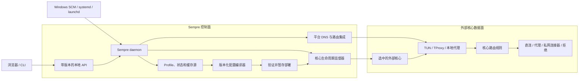
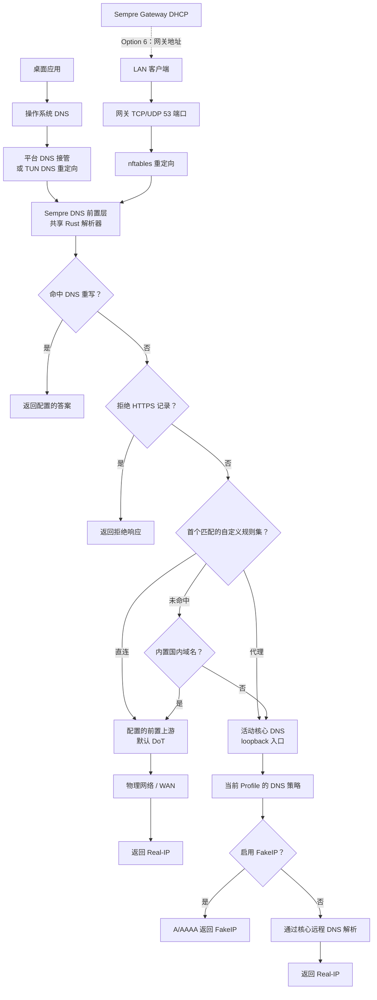
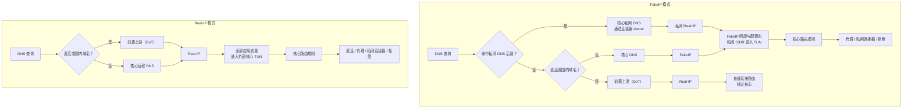
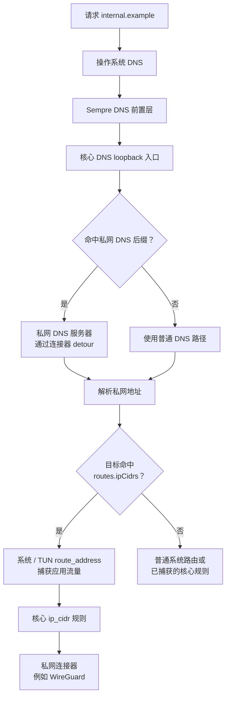

# Sempre

[English](README.md) | [简体中文](README.zh-CN.md)

Sempre 是一个跨平台的代理核心生命周期管理器。

它负责安装和切换核心版本、验证和更新配置、注册原生系统服务，并持续运行当前选中的核心。目前支持的核心包括 [sing-box](https://github.com/SagerNet/sing-box) 和 [Mihomo](https://github.com/MetaCubeX/mihomo)。

> 任意核心。始终最新。持续运行。

项目主页：[sempre.run](https://sempre.run)

Sempre 是一个独立的社区项目，与 SagerNet、Project X、MetaCubeX 及其项目均无隶属关系。

> [!WARNING]
> Sempre 目前仍是 1.0 之前的软件，会安装具有特权的系统服务并管理网络代理进程。运行前请阅读发布说明、保留可用的恢复路径，并先在非关键设备上测试升级。最初的 v0.1 二进制尚未进行代码签名；运行前请校验 checksum 和 GitHub attestation。

## 为什么选择 Sempre

Sempre 用一个 Rust 二进制和可独立替换的 Web UI，取代各平台专用的包装脚本和第三方服务宿主：



Sempre 是管理与控制面。TUN、代理协议、数据包处理和流量路由数据面均由选中的外部核心负责。

Windows 服务支持直接使用 Windows SCM API 实现。Sempre 不会下载、捆绑或调用 NSSM、PowerShell。

## 快速开始

Linux 和 macOS：

```sh
curl -fsSL https://sempre.run/install | sh
```

Windows PowerShell：

```powershell
irm https://sempre.run/install.ps1 | iex
```

[sempre.run](https://sempre.run) 的命令生成器可以在一次经过验证的安装中同时指定核心、订阅 URL 和 Web UI 来源。例如：

```sh
curl -fsSL https://sempre.run/install | sh -s -- --core='sing-box:tinymins/sing-box@13.11.2' --subscription='https://domain.com/some-subscription/xxx1safsadf'
```

```powershell
& ([scriptblock]::Create((irm https://sempre.run/install.ps1))) -Core 'sing-box:tinymins/sing-box@13.11.2' -Subscription 'https://domain.com/some-subscription/xxx1safsadf'
```

核心引用格式为 `<adapter>[:<github-owner>/<repository>][@<stable-or-version>]`。全新安装时，不指定 `--core`/`-Core` 会选择 `sing-box@stable`；已有选择则会保留。订阅 URL 会加入未命名的默认订阅集，重复 URL 会被移除，随后该订阅集会被激活和更新；生成的部署必须进入运行状态，否则安装器会失败。在线脚本通过私有临时文件把 URL 交给 Sempre，而不是放进子进程参数。不过 URL 仍出现在最初的命令中，因此请将 shell 历史和共享终端视为敏感信息。

UI 选项可接受 `official`、HTTPS ZIP，或 `tinymins/sempre-ui@stable` 这样的 GitHub Release 引用。HTTPS ZIP 可以附带 `--ui-sha256='<digest>'` 或 `-UISha256 '<digest>'`。GitHub UI Release 必须包含 `sempre-ui.zip`，并通过 Release 资源元数据或 `SHA256SUMS` 提供其 SHA-256。不指定 UI 选项时，已安装的自定义 UI 会保留；全新安装使用官方 UI。

安装器会检测操作系统和架构，解析到一个确定的 GitHub Release tag，并使用该 Release 的 `SHA256SUMS` 验证对应 bundle 后再运行。脚本可在 [sempre.run/install](https://sempre.run/install) 和 [sempre.run/install.ps1](https://sempre.run/install.ps1) 查看。

验证通过的 bundle 随后运行：

```text
sempre install
```

可以反复运行 `install`，从当前 bundle 安装、修复或升级 Sempre。它会把二进制和 bundle 中的 UI 复制到受保护的系统目录，注册原生服务，启动 Web 控制面，并在默认浏览器中打开。除非显式安装选项要求替换，否则已有订阅、隧道、网关设置、Web 设置和自定义 UI 都会保留。没有订阅或已有配置时，服务会保持 `idle`。安装后请打开新终端；`sempre status`、`sempre doctor` 及其他 CLI 命令会在全局可用。

在 Linux 上，sing-box 和 Mihomo Profile 可以作为 TUN 路由器或完全托管的 TProxy 网关运行。Debian、Ubuntu、Proxmox VE 的设置、路由所有权、MetaCubeX 访问和恢复步骤记录在 [Linux 透明网关](docs/linux-transparent-gateway.md)。稳定、规划中、实验性和仅协议支持的能力边界记录在 [核心能力模型](docs/core-capability-matrix.md)。

如需离线或完全手动安装，请从[下载](#下载)部分下载并解压 bundle，然后自行运行 `sempre install`。

不带参数运行二进制（包括双击）时，只显示当前版本/状态和最多四个操作：

| 操作 | 结果 |
| --- | --- |
| 打开 Web UI | 打开自动发现的本地控制面地址 |
| 安装、修复或升级 | 启动器根据服务状态和已安装版本选择一个标签，再从当前 bundle 执行幂等系统安装 |
| 卸载 | 默认保留配置，并提供显式清除选项 |
| 便携运行 | 在二进制旁运行 Web 控制面和选中核心；仅在系统服务未运行时显示 |

启动器本身不包含设置。请通过 Web UI 或对应 CLI 配置所有功能。完整 CLI 设置方式仍然可用：

```text
sempre core install sing-box@stable
sempre core use sing-box@stable
sempre subscription set https://example.com/subscription
sempre open
```

若要将二进制和数据都保存在一个可移动目录中：

```text
sempre --portable portable run
```

`sempre portable enable` 会在可执行文件旁创建持久的 `.sempre-portable` 标记。`--portable` 和 `--system` 可为单次调用选择运行模式。

## 下载

正式 Release 发布在 [github.com/tinymins/sempre/releases](https://github.com/tinymins/sempre/releases)。推荐使用 bundle，因为它包含经过验证的官方 UI，以及预安装的稳定版 sing-box、Mihomo、Xray 和 V2Ray 核心：

| 平台 | amd64 | arm64 |
| --- | --- | --- |
| Windows | [Bundle](https://github.com/tinymins/sempre/releases/latest/download/sempre-bundle-windows-amd64.zip) | [Bundle](https://github.com/tinymins/sempre/releases/latest/download/sempre-bundle-windows-arm64.zip) |
| Linux | [Bundle](https://github.com/tinymins/sempre/releases/latest/download/sempre-bundle-linux-amd64.zip) | [Bundle](https://github.com/tinymins/sempre/releases/latest/download/sempre-bundle-linux-arm64.zip) |
| macOS | [Bundle](https://github.com/tinymins/sempre/releases/latest/download/sempre-bundle-darwin-amd64.zip) | [Bundle](https://github.com/tinymins/sempre/releases/latest/download/sempre-bundle-darwin-arm64.zip) |

也可以下载独立二进制，它会安装不带 bundle UI 或核心的服务。离线安装 UI 时，把标准 `resources/` 目录放到独立二进制旁；也可以稍后运行 `sempre ui install official`：

| 平台 | amd64 | arm64 |
| --- | --- | --- |
| Windows | [下载](https://github.com/tinymins/sempre/releases/latest/download/sempre-windows-amd64.exe) | [下载](https://github.com/tinymins/sempre/releases/latest/download/sempre-windows-arm64.exe) |
| Linux | [下载](https://github.com/tinymins/sempre/releases/latest/download/sempre-linux-amd64) | [下载](https://github.com/tinymins/sempre/releases/latest/download/sempre-linux-arm64) |
| macOS | [下载](https://github.com/tinymins/sempre/releases/latest/download/sempre-darwin-amd64) | [下载](https://github.com/tinymins/sempre/releases/latest/download/sempre-darwin-arm64) |

Release checksum 位于 [`SHA256SUMS`](https://github.com/tinymins/sempre/releases/latest/download/SHA256SUMS)。每个目标还包含 CycloneDX JSON SBOM。使用以下命令验证构建来源：

```text
gh attestation verify <downloaded-binary> --repo tinymins/sempre
```

## 核心版本

Sempre 对可变通道和精确版本采用不同语义：

```text
sempre core install sing-box@stable
sempre core install sing-box@1.13.15
sempre core install sing-box:tinymins/sing-box@stable
sempre core install sing-box:tinymins/sing-box@1.13.15-ddns.1
sempre core install mihomo@stable
sempre core install mihomo@1.19.29
sempre core list
sempre core use sing-box@stable
sempre core use mihomo@stable
sempre core use sing-box@1.13.15
sempre run --core sing-box@1.13.15
sempre core update sing-box@stable
sempre core remove sing-box@1.13.15
```

核心引用格式为 `<adapter>[:<github-owner>/<repository>][@<stable-or-version>]`。每个适配器都有官方默认仓库：

| 适配器 | 默认仓库 | 编译配置 | Release 包 |
| --- | --- | --- | --- |
| `sing-box` | `SagerNet/sing-box` | 针对版本/平台的 sing-box JSON | Windows 为 ZIP，其他平台为 tar.gz |
| `mihomo` | `MetaCubeX/mihomo` | Clash Meta YAML | Windows 为 ZIP，其他平台为单文件 gzip |

仓库和版本是两个独立的身份维度：官方 `1.13.15` 与 fork 的 `1.13.15` 可以独立安装和选择，不会改变各自二进制报告的版本。自定义来源必须在后续命令中保持显式，例如 `sempre core use sing-box:tinymins/sing-box@1.13.15-ddns.1`。

在 amd64 上，Mihomo 适配器会检测主机的 x86-64 微架构等级。Level 3 主机依次尝试 `v3`、`v2`、`compatible`；Level 2 主机依次尝试 `v2`、`compatible`；其他或未知主机使用 `compatible`。Sempre 不会选择高于检测等级的二进制，也不会使用未带等级的 amd64 资源。arm64 直接使用官方 OS/arm64 资源。自定义 Mihomo 仓库必须遵循相同的资源命名和 SHA-256 元数据契约。

`stable` 对每个仓库都保持相同含义：最新的非 draft、非 prerelease GitHub Release。要安装 fork 的预发布版本，请指定精确版本。Sempre 不提供隐式 prerelease 通道。

精确版本会一直保留，直到被显式移除。通道是指向具体版本的弱引用。当 `stable` 前进时，旧版本只有在不再被精确安装、活动部署、回滚部署或其他通道引用时才会删除。

安装版本不会改变当前选择的核心。首次安装后请运行 `core use`；即使尚无配置也允许这样做。下一次保存 Profile、运行 `subscription set` 或 `config import` 时，Sempre 会为当前选择转换订阅，使用已安装核心验证，然后暂存新部署。通道更新会先使用当前配置验证，再推进通道。

`core remove` 会删除具体版本目录及所有指向它的通道别名。如果该版本仍被选中、正在活动或作为唯一自动回滚部署保留，删除会失败。

`sempre run --core` 可临时运行一个已安装版本，而不改变服务选择。

## 配置

```text
sempre subscription list
sempre subscription create <name>
sempre subscription show [profile-id]
sempre subscription save <profile-id> <profile.json>
sempre subscription use <profile-id>
sempre subscription update [profile-id]
sempre subscription render <profile-id> [format]
sempre subscription source add-url <http-or-https-url>
sempre subscription source add-raw <file>
sempre subscription set <http-or-https-url>
sempre subscription schedule 24h
sempre subscription schedule off
sempre subscription auto-restart <true|false>
sempre subscription status
sempre subscription clear
sempre subscription set ""
sempre custom-node <list|add|update|remove>
sempre config import <file>
sempre update
```

Sempre 保存多个订阅 Profile，并确保只有一个处于活动状态。一个 Profile 可以组合 HTTP/HTTPS 源、原始订阅文本和可复用自定义节点。`config import` 会把文件作为原始源加入，不再绕过转换而直接安装完整核心配置。两种清除形式都会移除活动 Profile 的源和检查历史，同时保留活动配置。

所有核心共享同一个活动 Profile。Sempre 为每个适配器分别保存编译配置，并记录生成它的 Profile revision 和编译目标。切换核心时，只有元数据仍然最新才会复用配置；否则 Sempre 会从缓存订阅快照重新编译，用选中的二进制验证并暂存新部署，不会重新获取远程源。显式或定时订阅更新会刷新远程快照，并使其他核心的编译配置失效，直到再次选择它们。

共享 Rust 转换流水线接受 Clash YAML/JSON 代理列表和宽松 Base64 URI 订阅。它会解析 VLESS、VMess、Shadowsocks、Trojan、Hysteria、Hysteria 2、TUIC 和 AnyTLS 节点，然后生成 Clash、Clash Meta、clash-rs、sing-box v1.11-v1.14、Xray、V2Ray 或 dae 配置。Linux 网关 Profile 默认使用 TUN Router 模式。选中的核心版本和主机平台决定活动 Profile 的输出格式。规则提供者 YAML 会被获取并内嵌到 sing-box 配置，因此生成配置不依赖公共 Sempre 转换端点。

顶层 `update` 命令只更新订阅。核心通道需要使用 `core update` 显式更新。

每个订阅响应最多 32 MiB，只能通过 HTTP 或 HTTPS 下载，重定向也限制为这两种协议。获取操作最多重试三次，并使用由 URL、User-Agent 和获取模式组成键的持久化最后已知良好缓存。原始响应和生成配置按内容哈希保存。编辑 Profile 只持久化本地数据，不会获取、编译或验证核心；显式更新或运行时启动才执行这些工作。下载、转换、验证、解析或启动失败时都会保留上一个部署。订阅数据使用受限权限，普通状态输出和日志不会显示 URL。

默认每 24 小时自动检查活动 Profile 中启用的 URL 源；全局间隔最短为五分钟。定时检查发现配置变化时会暂存配置，并默认重启托管核心；`subscription auto-restart false` 会让配置保持 pending。交互式 Profile 修改从不自动重启核心。请在检查预览后显式重启，或让暂存配置在下次启动时应用。空 Profile 仍然有效，并保留最后一个活动配置。

## DNS 与流量分流

DNS 解析与应用流量是两条独立路径。Sempre 让两者保持一致，但不会把 DNS 前置层变成代理核心或 TUN 数据面。

### DNS 前置层与网关 DNS

桌面系统 DNS 和 Linux 网关 DNS 最终进入同一个托管 Rust 解析器。Gateway DHCP 通过 DHCP Option 6 告知客户端网关地址；nftables 将 LAN TCP/UDP 53 端口重定向到托管前置层。网关模式改变查询如何到达前置层，但不会产生第二个 DNS 策略所有者。



自定义规则集按顺序在内置国内域名集之前求值。直连规则使用配置的前置上游；代理规则和默认路径使用活动核心 DNS。同一组规则还会被编译成高优先级业务路由：直连规则集路由到 `direct`，代理规则集则获得独立代理选择组。

在 **DNS → 设置与状态** 中配置前置上游。输入框接受 `tls://`、`tcp://`、`udp://`，也兼容旧的 `host:port`；多个地址用逗号分隔，按顺序尝试。留空保存恢复默认值：

```text
tls://223.6.6.6:853?server_name=dns.alidns.com, tls://223.5.5.5:853?server_name=dns.alidns.com
```

默认使用[阿里公共 DNS 的 DoT 服务](https://alidns.com/)，直接连接 IP 并按 `dns.alidns.com` 校验证书，避免先依赖系统 DNS 解析上游地址。域名形式的上游也通过默认 DoT 引导解析，不依赖系统解析器。TCP/TLS 连接会复用。保存上游直接更新前置层，无需重新编译或重启核心；已有自定义上游会保留。不建议修改默认配置：普通 UDP/TCP 53 端口可能被本机其他软件再次劫持，造成循环查询或超时。遇到问题时清空输入框并保存，即可恢复 DoT。

Windows x64 使用安装包内的 WinDivert 辅助进程截获出站 UDP/TCP 53，转交 loopback 1054 上的前置层；无需监听 53，也不依赖核心的 TUN DNS 重定向。辅助进程随所属 daemon 退出；升级和卸载前，Sempre 仅在确认无人使用时卸载属于本安装目录的驱动。WinDivert 优先级仅排序其自身网络层句柄，不能保证绕过其他 WFP 层。原生 x64 构建使用校验过的官方 WinDivert 2.2.2 SDK（`cargo run --manifest-path=rust/Cargo.toml -p sempre-build -- dns-capture-sdk`）；直接运行 Cargo 检查时需设置 `WINDIVERT_PATH` 并将 SDK 的 `x64` 目录加入 `PATH`。打包工具自动完成这一步，附带 DLL、签名驱动、许可证和校验文件。Windows ARM64 保留现有接管方式。

### 托管桌面 TUN 模式

Real-IP 模式仍保留 DNS 前置分流。模式改变的是哪些应用流量进入外部核心，而不是前置 DNS 是否存在。下面的流程适用于托管桌面 sing-box TUN 目标；Linux 网关模式通过 TProxy 捕获 LAN 流量。



FakeIP 模式下，直连和国内域名返回真实地址并绕过核心。代理和默认域名返回 `198.18.0.0/15` 或 `fc00::/18` 范围内的地址；这些网段以及每个已启用私网连接器的 `routes.ipCidrs` 都会进入 TUN。因此私网 DNS 可以返回真实私网地址，而匹配的私网 CIDR 仍会进入核心。Real-IP 模式下，直连和国内域名仍使用前置上游，代理和默认域名使用核心远程 DNS；随后所有应用流量进入核心并遵循核心路由规则。

### 私网 DNS 与私网路由

私网 DNS 只控制名称解析。连接还必须独立命中同一连接器的域名或 IP 路由。



连接器的私网 DNS 服务器会写入核心，并以该连接器作为 `detour`；DNS 前置层不会直接连接私网 DNS。在受限的托管桌面 TUN 目标上，`routes.ipCidrs` 承担双重职责：扩展 TUN 的系统捕获路由，同时生成选择该连接器的核心 `ip_cidr` 规则。域名匹配仍然只是核心规则，不会安装系统路由。因此私网 DNS 成功返回，不代表应用流量已经使用私网出站；排查时必须同时验证 DNS 决策、TUN 捕获路由和核心最终选择的 outbound。

## 托管运行时

Sempre Service 和它管理的核心具有独立生命周期。停止托管核心后，Web 控制台和 API 仍保持在线：

```text
sempre runtime status
sempre runtime start
sempre runtime stop
sempre runtime restart
```

`runtime status` 会报告持久化期望状态、观测运行状态、精确核心引用、配置哈希、PID、运行时间、重启次数、最后一次状态转换、退出信息和错误。启动、停止、重启都是幂等操作，并由 daemon 串行化，因此并发 CLI 和 Web 请求不会创建两个核心进程。显式停止会跨 Sempre Service 和操作系统重启保持。重启已停止的核心会将其期望状态改为 running 并启动。

经过认证的 Web 客户端通过 `GET /api/v1/runtime/status` 和 `POST /api/v1/runtime/{start,stop,restart}` 使用同一套生命周期。变更请求返回 `202 Accepted`；客户端轮询状态，直到运行时进入终态。本地 CLI 会发现受保护的 loopback-only daemon 端点，并使用同一 API 和生命周期管理器。

## Web 控制面

daemon 运行时，Sempre 始终提供带版本的 API 和已安装 UI，即使尚未选择核心。默认监听 `127.0.0.1:33211`；发现元数据写在已安装二进制旁，因此 `sempre open` 和启动器不会假设固定端口。

```text
sempre web status --json
sempre web listen 127.0.0.1:33211
printf 'new-password\n' | sempre web password set --stdin
sempre web password clear
sempre ui status
sempre ui install official
sempre ui install tinymins/sempre-ui@stable
sempre ui install tinymins/sempre-ui@1.2.3
sempre ui install https://example.com/sempre-ui.zip --sha256 <digest>
sempre ui install ./sempre-ui.zip --sha256 <digest>
sempre ui update
sempre ui remove
```

空管理员密码只允许同源 UI 使用，并会显示警告。跨源 UI 访问必须设置密码；密码使用 Argon2id 保存，成功登录会获得有期限的 bearer session。修改监听地址会进行实时重绑定：Sempre 先打开新 socket，再关闭旧 socket，失败时回滚配置。

官方 React 控制台包含托管核心状态与生命周期控制、实时流量、代理选择和延迟检查、Providers、连接、规则、本地流量聚合、日志、核心版本、订阅转换 Profile、自定义节点、源和字段级诊断、配置预览、监听与密码设置，以及 UI 生命周期管理。运行时能力也可通过 `sempre runtime` 使用；运行 `sempre help` 查看完整命令图。

UI 压缩包是独立的第三方组件。兼容 ZIP 的根目录必须包含 `index.html` 和 `sempre-ui.json`，声明 Sempre API major 1，并在原子激活前通过大小、路径和 symlink 检查。任何时候只有一个活动 UI。`sempre install` 会保留本地安装的自定义 UI；官方 UI 会从 bundle 或匹配的 Release 更新。GitHub 来源使用 `<owner>/<repository>@stable|version`，必须提供固定的 `sempre-ui.zip` 资源及发布的 SHA-256，并可通过 `sempre ui update` 更新。

## 服务

```text
sempre service install
sempre service uninstall
sempre service start
sempre service stop
sempre service restart
sempre service status
```

`service install` 使用原生系统服务管理器注册 Sempre，启用并启动服务。它还会把 Sempre 和 bundle 资源复制到受保护的系统可执行目录，因此之后可以移动或删除原始下载。核心、配置和订阅状态会与已有安装合并；系统订阅、隧道、网关设置、Web 设置和 UI 优先于便携模式默认值。`service uninstall` 只删除服务注册；顶层 `uninstall` 删除应用，但默认保留配置、订阅、监听和密码，除非指定 `--purge`。

便携模式可以显式将准备好的离线资源部署到系统服务：

| 命令 | 替换 | 保留 |
| --- | --- | --- |
| `service deploy bin` | Sempre 服务可执行文件、bundle 资源和服务注册 | 核心、状态、配置、Web 设置、UI、日志、运行时 |
| `service deploy core` | 便携模式中的托管核心/版本目录 | 系统中额外的核心版本、状态、配置、日志、运行时 |
| `service deploy data` | 状态、订阅目录/缓存/快照、引用配置、隧道、网关设置、Web 监听/密码和当前 UI | Sempre 二进制、核心、日志、运行时 |
| `service deploy all` | Sempre 二进制/资源、精确核心快照、状态、订阅数据、引用配置、隧道、网关设置、Web 监听/密码和当前 UI | 日志和运行时 |

`service deploy` 只在便携模式下可用，并要求系统服务已安装。仅数据部署会先验证便携状态引用的每个核心版本在系统存储中都已存在。`all` 会删除不在便携快照中的系统核心版本；`core` 则刻意保留它们。

便携模式下的 `service install` 会把便携资源合并进已安装系统、修复原生服务注册并启动服务。这是安全修复路径，会保留系统拥有的托管配置。相比之下，`service deploy data` 和 `service deploy all` 是快照操作。它们会先汇总核心状态、订阅、隧道、网关设置、Web 设置和 UI 的变化，再替换有意义的系统数据；只有明确审阅过的无人值守部署才应使用 `--yes`。部署会先在目标卷暂存文件，暂存成功后才停止服务；激活失败时恢复文件和之前的服务状态。

要进行可重复的批量部署，可以从已配置实例导出平台专用 bundle：

```text
sempre bundle export ./out
sempre --portable bundle export ./out
```

命令以当前模式为来源：系统模式导出受保护的系统数据，便携模式导出可执行文件旁的 `.sempre` 目录。输出包括展开的 `sempre-bundle-<os>-<arch>/` 目录和对应 ZIP。bundle 包含当前 Sempre 可执行文件、资源、状态记录的全部核心版本、引用的生成配置、订阅目录/缓存/快照、隧道、网关设置、Web 监听和当前 UI。快照 bundle 带有 kind 为 `snapshot` 的 `.sempre-bundle.json`。导出的 `web.json` 会有意清除管理员密码哈希；确认恢复快照后，目标密码也会被清除。

每个 bundle 只适用于创建它的操作系统和架构。请通过专用交互入口在目标机器恢复快照：Windows 使用 `restore.cmd`，macOS 使用 `restore.command` 或 `restore.sh`，Linux 使用 `restore.sh` 或 `restore.desktop`。这些入口会调用显式恢复命令并转发附加选项：

```text
sempre bundle restore
```

恢复会显示完整替换摘要，并要求确认，除非指定 `--yes`。官方 Release bundle 的 kind 为 `release`；它们的 `install.*` 入口调用会保留已有配置的 `sempre install`。`bundle restore` 会拒绝 Release bundle 和没有快照元数据的目录。

Sempre 在所有平台上监督核心。意外退出使用有界指数退避。Unix 进程组和 Windows Job Object 确保服务停止时清理子进程。便携前台运行与系统 daemon 共享一个整机实例锁，因此不会同时启动两个托管 sing-box 进程。

Windows 提权使用原生 `runas` API，Sempre 不调用 PowerShell。Linux 和 macOS 使用 `sudo`。帮助、版本、便携标记管理和 `service status` 不需要提权。便携 Windows 菜单在进入时只请求一次提权；便携 Unix 菜单保持非特权，只在前台运行和服务操作时请求 `sudo`。

## 诊断

```text
sempre status
sempre logs
sempre logs --follow
sempre doctor
sempre version
```

日志在 10 MiB 时轮转，并保留三个备份。Sempre 不假设用户配置提供了 Clash API 端口、TUN 接口名或其他代理产品。对支持的核心，Sempre 会生成受保护的临时运行配置，使用随机 loopback 控制端口和 secret；原始配置不会被改写。`status` 会将记录的 PID 与操作系统及共享实例锁交叉检查，因此中断或被强制结束的进程会报告为 stale。`doctor` 检查文件、配置验证、进程一致性和原生服务管理器；未安装的服务只作为信息，不会被误报为损坏的服务可执行文件。

## 数据目录

系统模式是默认模式：

| 平台 | 可执行文件 | 数据 | 日志 | 运行时 |
| --- | --- | --- | --- | --- |
| Windows | `%ProgramFiles%\Sempre\sempre.exe` | `%ProgramData%\Sempre` | `%ProgramData%\Sempre\logs` | `%ProgramData%\Sempre\run` |
| Linux | `/usr/local/libexec/sempre/sempre` | `/var/lib/sempre` | `/var/log/sempre` | `/run/sempre` |
| macOS | `/Library/Application Support/Sempre/bin/sempre` | `/Library/Application Support/Sempre/data` | `/Library/Logs/Sempre` | `/var/run/sempre` |

状态 schema 6 增加了按核心记录的配置构建来源。迁移时会保留已有哈希和当前部署；旧哈希因为没有来源信息，会在下次选择该核心时重新编译。更早的迁移仍将旧期望状态默认为 `running`。旧版 Sempre 会拒绝较新的 schema，而不是静默丢弃状态；降级时请恢复升级前快照，或使用匹配 Release 迁移文档。

便携模式在可执行文件旁保留以下结构：

```text
sempre.exe
.sempre-portable
endpoint.json
resources/
|-- sempre-ui.zip
`-- SHA256SUMS
.sempre/
|-- state.json
|-- web.json
|-- cores/
|   |-- sing-box/<version>/
|   |-- sing-box/sources/<owner>/<repository>/<version>/
|   |-- mihomo/<version>/
|   |-- xray/<version>/
|   `-- v2ray/<version>/
|-- configs/
|   |-- sing-box/<sha256>.json
|   `-- mihomo/<sha256>.json
|-- ui/
|   `-- current/
|-- logs/
`-- run/
```

系统服务始终使用受保护的系统可执行文件和 `--system daemon` 运行，即使安装由便携模式发起。

## 开发

在仓库根目录安装所有开发依赖，并启动 API、控制 UI 和网站：

```text
bun bootstrap
bun start
```

聚合命令输出带前缀的日志，并分别在 `http://127.0.0.1:33212`、`http://127.0.0.1:5173` 和 `http://127.0.0.1:4174` 提供开发 API、控制 UI 和网站。前端项目使用 Vite HMR；Cargo Watch 会重建并重启 Rust 开发 daemon。隔离状态行为、单独命令、调试和验证说明见 [`DEVELOPMENT.md`](DEVELOPMENT.md)。

## 构建

需要 Rust 1.95 或更高版本，以及 Bun 1.3.14。

```text
bun bootstrap
bun run lint
bun run tsc
bun run test
cargo test --manifest-path=rust/Cargo.toml --workspace
cargo clippy --manifest-path=rust/Cargo.toml --workspace --all-targets -- -D warnings
bun run build
```

构建命令会验证两个项目，并输出 Windows、Linux、macOS 的 amd64/arm64 二进制、`sempre-ui.zip`、标准 `resources/{sempre-ui.zip,SHA256SUMS}` 目录、六个自包含便携 bundle ZIP，以及 `dist/SHA256SUMS`。Bundle ZIP 包含官方 UI 和目标平台的稳定 sing-box、Mihomo、Xray、V2Ray 快照。Windows 资源使用 `asInvoker` manifest；只有特权命令在运行时请求 UAC。

带 tag 的 Release 构建使用 Rust 1.95，从 Git revision 生成可复现元数据，发布每个目标的 CycloneDX SBOM，并附加 GitHub artifact attestation。Release 二进制目前没有操作系统级签名。

Release bundle 会再分发上面列出的稳定核心二进制。其他核心安装和更新在运行时从选中的 GitHub 仓库下载，并使用 GitHub Release API 提供的 SHA-256 验证。自定义仓库仍使用所选适配器的资源命名、配置验证和二进制版本契约；不接受任意可执行文件。

## 许可证

Sempre 使用 [BSD 3-Clause License](LICENSE)。下载的代理核心仍受各自许可证约束。
