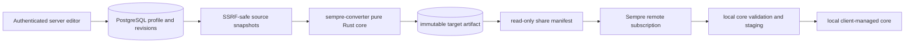

# Rust Subscription Integration

Sempre now has two product roles around one versioned remote artifact contract:

The server never installs, validates with, starts, stops, or supervises a proxy
core. A Sempre client still owns local core validation, atomic staging,
activation, rollback, and runtime lifecycle.

## Delivered boundary

| Capability | Rust server and remote client | Evidence boundary |
| --- | --- | --- |
| Pure conversion core | Implemented | `Profile + SourceSnapshot + CustomNode + Target -> CompileResult`; no HTTP, database, environment, or process access |
| Multi-user profiles | Implemented | Registration/login/logout, owner/editor/viewer roles, optimistic profile revisions |
| Source handling | Implemented | Raw and URL sources, user agent, TTL cache, three-attempt retry, optional domestic-direct proxy, last-known-good snapshot |
| Fetch safety | Implemented | HTTP(S) only, no URL credentials, public-address DNS pinning, redirect revalidation, timeout and response-size limits |
| Node input | Implemented | Clash YAML, Base64 URI lists, plain URI lists, manual nodes, reusable authorized custom-node library |
| Protocol conversion | Implemented for the OhMyWRT executable path | VMess, VLESS, Shadowsocks/plugins, Trojan, Hysteria, Hysteria2, TUIC, HTTP, SOCKS5, AnyTLS from Clash nodes; URI parsing matches the reference parser's actually dispatched schemes |
| Naming/filtering | Implemented | Source prefix, source-only filters, reference country-flag normalization, deterministic duplicate names and node origins |
| Rules | Implemented | Clash custom rule strings, native sing-box rule objects, rule providers, and SSRF-safe Clash-rule-set to sing-box source JSON compatibility routes |
| Output targets | Implemented | Clash, Clash Meta, clash-rs, sing-box 1.11-1.14 platform variants, Xray, V2Ray, and dae with explicit field-loss diagnostics |
| Publishing | Implemented | Per-target immutable artifacts, SHA-256, ETag, revocable share token, manifest runtime intent and authenticated editor URL |
| Remote client | Implemented | Same-origin artifact enforcement, exact target/hash verification, read-only local display, server edit link, local validation/staging path |
| Site operations | Implemented | Artifact preview and diagnostics, custom-node management, membership/share management, artifact access counts |

## Local integration

The local daemon and multi-user server now call `sempre-converter` as a Rust
library. There is no worker process or fallback compiler. The same profile,
snapshot, custom-node, and target contract therefore produces both local and
published artifacts.

Local profile saves remain persistence-only. Explicit refresh and runtime
startup fetch snapshots, compile with the shared core, validate against the
selected external core binary, and atomically stage the result. Missing inputs
or validation failures preserve the saved draft and the last working runtime
deployment.
